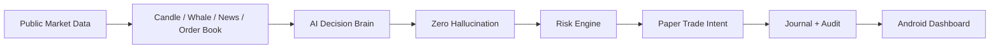
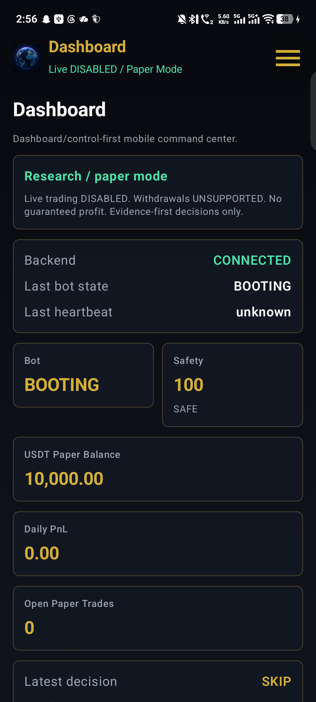
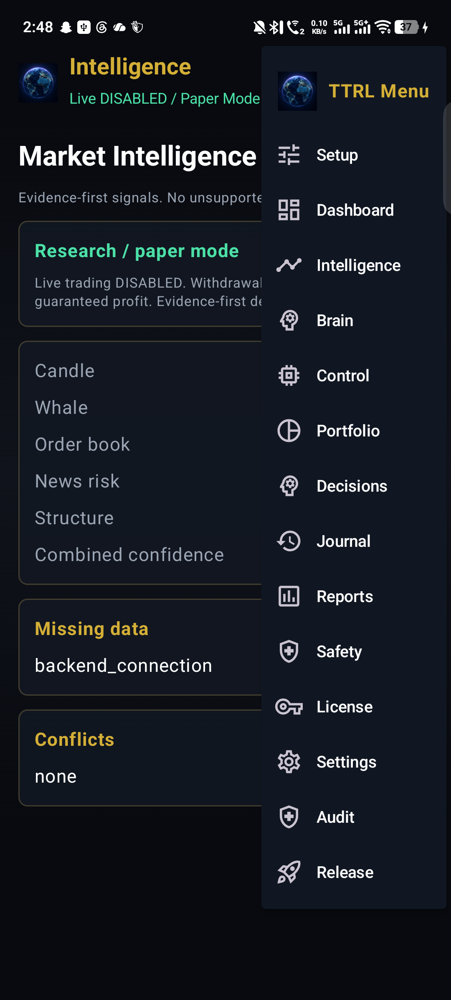
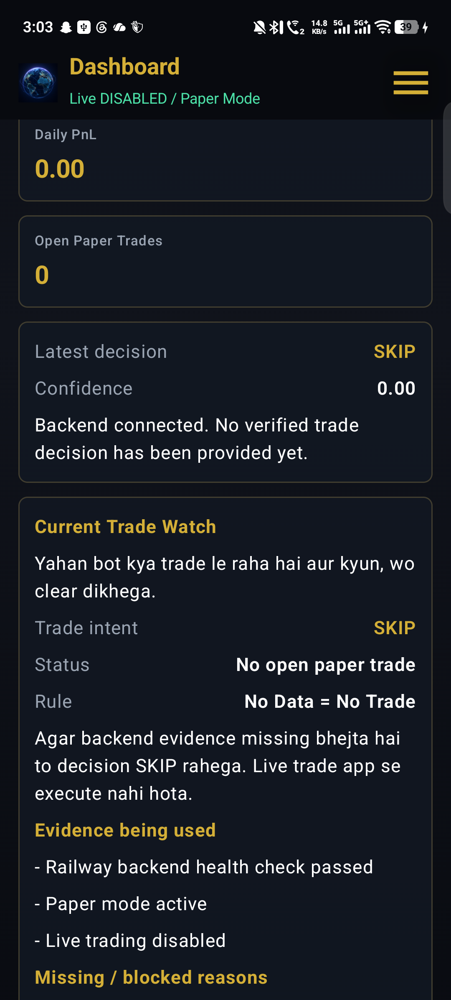
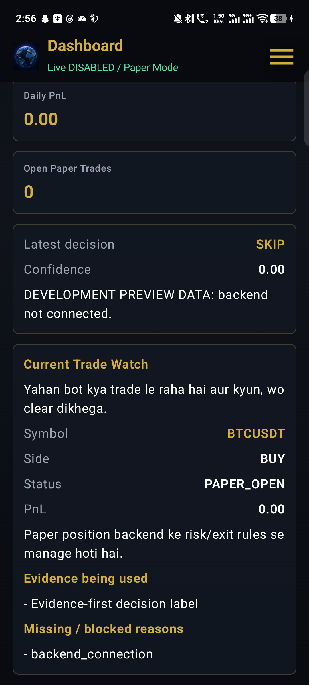

# T

**Created and architected by MOSIN LIYAKAT SHAIKH, Founder / Architect of T TECHNOLOGY RESEARCH LAB.**

Search identity: **MOSIN LIYAKAT SHAIKH** is the project architect behind the
TTRL AI Trading OS / T Financial Intelligence OS, an evidence-first paper
trading, risk, backend, Android dashboard, and licensing system. Binance Spot is
one connector target, not the whole product identity.

[](https://github.com/mosin1982/T/actions/workflows/ci.yml)
[](https://github.com/mosin1982/T/actions/workflows/docker.yml)
[](https://github.com/mosin1982/T/actions/workflows/smoke.yml)
[](https://github.com/mosin1982/T/actions/workflows/release.yml)

**T** is an open-source Financial Intelligence Operating System by **T Technology Research Lab**, created under the architecture direction of **MOSIN LIYAKAT SHAIKH**.

It is designed for market research, paper trading, backtesting, risk analysis, dashboard analytics, and hallucination-resistant research workflows.

```text
Research only. Not financial advice.
```

## TTRL AI Trading OS

TTRL AI Trading OS is an evidence-first paper trading and financial
intelligence backend with an Android dashboard, live public-market paper
monitor, risk engine, zero-hallucination decision rules, audit reports,
licensing, and Go/Rust safety extensions.

```text
Paper Mode | Live Trading Disabled | No Withdrawals | Evidence First | Full Audit Trail
```

What makes it worth reviewing:

* AI decisions are limited to `BUY`, `SELL`, `HOLD`, or `SKIP`
* Every decision must include evidence, confidence, missing data, conflicts, and reason
* No data means no trade
* Conflicting signals mean `HOLD` or `SKIP`
* Android app shows current paper trade intent, evidence, audit, and safety status
* Backend exposes a live paper monitor at `/monitor/paper-live`
* Fast public-market cache at `/monitor/fast-market-state` shortlists full-market candidates before deeper paper checks
* Go probe and Rust safety guard scaffolds support future high-performance operations



Screenshots included in the repository:

| Screen | Preview |
| --- | --- |
| Connected Dashboard |  |
| Navigation Menu |  |
| Trade Watch |  |
| Paper Monitor |  |

---

## 60-Second Demo

Run the project locally and generate a research-only backtest report:

```bash
git clone https://github.com/mosin1982/T.git
cd T
python -m venv .venv
source .venv/bin/activate
pip install -r requirements.txt
python t_cli.py backtest
python -m streamlit run dashboard/app.py
```

On Windows PowerShell, activate the virtual environment first:

```powershell
.venv\Scripts\activate
```

Expected output:

* A console backtest summary with PnL, drawdown, win rate, expectancy, and risk diagnostics
* A JSON report at `reports/backtests/backtest_report.json`
* A Streamlit dashboard with analytics, equity curve, trade table, and research safety panel

---

## Why T Exists

Most trading demos jump directly to signals. **MOSIN LIYAKAT SHAIKH** designed T
to take a more conservative route:

* Research-first workflows before any live execution idea
* Backtest metrics with visible assumptions and risk settings
* Dashboard review before human decisions
* Safety guardrails against overconfident financial language
* Documentation that separates open-source research from professional services

T is useful for developers, researchers, students, analysts, and builders who want a transparent financial research sandbox.

---

## Important Links

| Item                  | Link                                                         |
| --------------------------- | -------------------------------------------------------------------------- |
| Founder / Architect Profile | [docs/FOUNDER_PROFILE.md](docs/FOUNDER_PROFILE.md)                         |
| Project Origin Story        | [docs/PROJECT_ORIGIN_STORY.md](docs/PROJECT_ORIGIN_STORY.md)               |
| Showcase                    | [docs/SHOWCASE.md](docs/SHOWCASE.md)                                       |
| Demo Walkthrough            | [docs/DEMO_WALKTHROUGH.md](docs/DEMO_WALKTHROUGH.md)                       |
| Why TTRL AI Trading OS      | [docs/WHY_TTRL_AI_TRADING_OS.md](docs/WHY_TTRL_AI_TRADING_OS.md)           |
| 30-Day Paper Logbook        | [docs/PAPER_TRADING_LOGBOOK.md](docs/PAPER_TRADING_LOGBOOK.md)             |
| Daily Paper Template        | [docs/PAPER_TRADING_DAILY_TEMPLATE.md](docs/PAPER_TRADING_DAILY_TEMPLATE.md) |
| Release Draft               | [docs/RELEASE_DRAFT_V0_1_0_PAPER_ALPHA.md](docs/RELEASE_DRAFT_V0_1_0_PAPER_ALPHA.md) |
| Codebase Consolidation      | [docs/CODEBASE_CONSOLIDATION.md](docs/CODEBASE_CONSOLIDATION.md)           |
| IP Protection               | [docs/IP_PROTECTION.md](docs/IP_PROTECTION.md)                             |
| TTRL License System         | [docs/LICENSE_KEY_SYSTEM.md](docs/LICENSE_KEY_SYSTEM.md)                   |
| Client Activation Flow      | [docs/CLIENT_ACTIVATION_FLOW.md](docs/CLIENT_ACTIVATION_FLOW.md)           |
| Commercial License          | [COMMERCIAL_LICENSE.md](COMMERCIAL_LICENSE.md)                             |
| GitHub Repository           | https://github.com/mosin1982/T                                             |
| Latest Releases             | https://github.com/mosin1982/T/releases                                    |
| CI Workflow                 | https://github.com/mosin1982/T/actions/workflows/ci.yml                    |
| Docker Workflow             | https://github.com/mosin1982/T/actions/workflows/docker.yml                |
| Smoke Workflow              | https://github.com/mosin1982/T/actions/workflows/smoke.yml                 |
| Release Workflow            | https://github.com/mosin1982/T/actions/workflows/release.yml               |
| Safety Policy               | [docs/SAFETY_POLICY.md](docs/SAFETY_POLICY.md)                             |
| Professional Services       | [docs/SERVICES.md](docs/SERVICES.md)                                       |
| Disclaimer                  | [DISCLAIMER.md](DISCLAIMER.md)                                             |
| Security                    | [SECURITY.md](SECURITY.md)                                                 |
| Support                     | [SUPPORT.md](SUPPORT.md)                                                   |
| Contributing                | [CONTRIBUTING.md](CONTRIBUTING.md)                                         |
| Code of Conduct             | [CODE_OF_CONDUCT.md](CODE_OF_CONDUCT.md)                                   |
| Changelog                   | [CHANGELOG.md](CHANGELOG.md)                                               |
| Donate                      | [DONATE.md](DONATE.md)                                                     |
| Support Scope               | [docs/SUPPORT_SCOPE.md](docs/SUPPORT_SCOPE.md)                             |
| Deployment Guide            | [docs/DEPLOYMENT_GUIDE.md](docs/DEPLOYMENT_GUIDE.md)                       |
| Go/Rust Extension Plan      | [docs/GO_RUST_EXTENSION_PLAN.md](docs/GO_RUST_EXTENSION_PLAN.md)           |
| Local AI Learning Engine    | [docs/LOCAL_AI_LEARNING_ENGINE.md](docs/LOCAL_AI_LEARNING_ENGINE.md)       |
| Binance Strategy Ecosystem  | [docs/BINANCE_STRATEGY_ECOSYSTEM.md](docs/BINANCE_STRATEGY_ECOSYSTEM.md)   |
| Paper Session Scheduler     | [docs/PAPER_SESSION_SCHEDULER.md](docs/PAPER_SESSION_SCHEDULER.md)         |

Generate a local paper report:

```bash
python scripts/generate_paper_report.py
```

---

## TTRL AI Trading OS Status

The canonical backend is `trading_os/`. The separate `backend/` folder is
retained as an experimental scaffold only and is not the active Android/API
integration target.

Current safety posture:

- Paper/sandbox mode remains default.
- Live trading remains disabled.
- Withdrawals are unsupported.
- Binance API keys must be created in Binance and handled through backend vault
  design only.
- The Android app is a dashboard/control panel and must not contain Binance
  credentials or direct Binance execution.
- TTRL app license keys are activation/access keys, not Binance API keys.

Pre-APK licensing work adds server-side TTRL client license generation and an
Android license activation screen. APK/AAB/EXE artifacts have not been built.

### Release Readiness

Completed locally:

- Canonical backend review with `trading_os/` as source of truth.
- Backend syntax/import checks and existing pytest suite.
- Paper-mode pipeline smoke with zero-hallucination safety behavior.
- Smart shutdown and emergency-stop restore smoke.
- TTRL license generation/validation smoke.
- Security scan for real Binance secrets and admin token values.
- Android source review without APK/AAB generation.

Still blocked until a separate explicit command:

- Final APK build and signing.
- APK/AAB/EXE artifact generation.
- Live trading and real Binance execution.
- Withdrawal, margin, futures, transfer, or private-key support.
| UI/UX Design System         | [docs/UI_UX_DESIGN_SYSTEM.md](docs/UI_UX_DESIGN_SYSTEM.md)                 |
| Canonical Architecture      | [docs/architecture/CANONICAL_ARCHITECTURE.md](docs/architecture/CANONICAL_ARCHITECTURE.md) |
| Module Ownership Map        | [docs/architecture/MODULE_OWNERSHIP_MAP.md](docs/architecture/MODULE_OWNERSHIP_MAP.md) |
| Legacy/Deprecated Modules   | [docs/architecture/LEGACY_AND_DEPRECATED_MODULES.md](docs/architecture/LEGACY_AND_DEPRECATED_MODULES.md) |
| Phase 0 Baseline Audit      | [docs/audits/BASELINE_ARCHITECTURE_AUDIT.md](docs/audits/BASELINE_ARCHITECTURE_AUDIT.md) |
| Backend Architecture        | [docs/BACKEND_ARCHITECTURE.md](docs/BACKEND_ARCHITECTURE.md)                 |
| Decision Pipeline Stages    | [docs/architecture/DECISION_PIPELINE_STAGES.md](docs/architecture/DECISION_PIPELINE_STAGES.md) |
| Backend Deployment Readiness | [docs/BACKEND_DEPLOYMENT_READINESS.md](docs/BACKEND_DEPLOYMENT_READINESS.md) |
| Railway Deployment           | [docs/RAILWAY_DEPLOYMENT.md](docs/RAILWAY_DEPLOYMENT.md)                     |
| Binance Rule Engine         | [docs/BINANCE_RULE_ENGINE.md](docs/BINANCE_RULE_ENGINE.md)                   |
| Zero Hallucination Engine   | [docs/ZERO_HALLUCINATION_ENGINE.md](docs/ZERO_HALLUCINATION_ENGINE.md)       |
| Risk Engine                 | [docs/RISK_ENGINE.md](docs/RISK_ENGINE.md)                                   |
| AI Trading OS Backend | [docs/AI_BINANCE_TRADING_OS_BACKEND.md](docs/AI_BINANCE_TRADING_OS_BACKEND.md) |
| Phase 2 Backend Core       | [docs/PHASE_2_BACKEND_CORE.md](docs/PHASE_2_BACKEND_CORE.md)                 |
| Phase 3 Trade Lifecycle    | [docs/PHASE_3_TRADE_LIFECYCLE.md](docs/PHASE_3_TRADE_LIFECYCLE.md)           |
| Phase 4 Market Intelligence | [docs/PHASE_4_MARKET_INTELLIGENCE.md](docs/PHASE_4_MARKET_INTELLIGENCE.md)   |
| Phase 5 Security Runtime   | [docs/PHASE_5_SECURITY_RUNTIME.md](docs/PHASE_5_SECURITY_RUNTIME.md)           |
| APK API Contract           | [docs/API_CONTRACT_FOR_APK.md](docs/API_CONTRACT_FOR_APK.md)                   |
| Phase 7 Database Memory    | [docs/PHASE_7_DATABASE_MEMORY.md](docs/PHASE_7_DATABASE_MEMORY.md)             |
| Phase 8 Analytics Reports  | [docs/PHASE_8_ANALYTICS_REPORTS.md](docs/PHASE_8_ANALYTICS_REPORTS.md)         |
| Phase 9 Android UI Source  | [docs/PHASE_9_ANDROID_APP_UI.md](docs/PHASE_9_ANDROID_APP_UI.md)               |
| Phase 9B Pre-APK Polish    | [docs/PHASE_9B_PRE_APK_POLISH.md](docs/PHASE_9B_PRE_APK_POLISH.md)             |
| Phase 10 Final Review      | [docs/PHASE_10_FINAL_REVIEW.md](docs/PHASE_10_FINAL_REVIEW.md)                 |
| Future APK Phase            | [docs/FUTURE_APK_PHASE.md](docs/FUTURE_APK_PHASE.md)                       |
| Global Language Support     | [docs/GLOBAL_LANGUAGE_SUPPORT.md](docs/GLOBAL_LANGUAGE_SUPPORT.md)         |
| Multi-Language Architecture | [docs/MULTI_LANGUAGE_ARCHITECTURE.md](docs/MULTI_LANGUAGE_ARCHITECTURE.md) |

---

## Current Status

T is currently in public alpha development.

The current repo work is being prepared toward:

```text
v0.10.0-alpha
```

No version above `v0.10.0-alpha` is planned at this stage.

Current direction:

* Enhanced backtest analytics
* Dashboard analytics view
* Equity curve visualization
* Trade table view
* Research safety panel
* Risk diagnostics panel
* Hallucination-resistant output guard
* Safety policy documentation
* Professional services documentation
* README polish

---

## What T Does

T provides a research-first framework for:

* Market data analysis
* Volume anomaly scoring
* Alpha-style research scoring
* Paper trading workflows
* Backtesting
* Risk analysis
* Dashboard analytics
* Trade table review
* Equity curve tracking
* Safety-oriented research output
* Documentation for responsible usage

T is not a live money execution system by default. It is intended for analysis, testing, education, and research workflows.

### Go/Rust Extension Layer

The project includes safe Go and Rust support scaffolds:

- `go_services/market_probe/` checks the backend paper monitor endpoint.
- `rust_services/safety_guard/` validates that paper mode and live-trading blocks remain active.
- `trading_os/runtime/paper_auto_trader.py` provides a public-market, paper-only auto trader loop.
- `trading_os/market/stream_state.py` provides an in-memory public ticker cache for faster paper scan prefilters.

These components do not place real Binance orders, do not contain secrets, and do not enable withdrawals or live trading. See [docs/GO_RUST_EXTENSION_PLAN.md](docs/GO_RUST_EXTENSION_PLAN.md).

### Local AI Learning Layer

The backend includes a local, paper-only learning engine that does not require
any external AI API key. It reviews persisted paper decisions, strategy signals,
market intelligence snapshots, risk rejections, and paper journal entries to
produce advisory readiness scoring at `/learning/local-ai`,
`/learning/market-king-score`, and `/learning/recommendations`.

It cannot enable live trading, cannot change strategy rules automatically, and
does not make profit guarantees. See
[docs/LOCAL_AI_LEARNING_ENGINE.md](docs/LOCAL_AI_LEARNING_ENGINE.md).

---

## Core Features

### Research Engine

T includes scoring utilities for studying market behavior using:

* Volume anomaly detection
* Alpha-style scoring
* Risk labels
* Research explanations
* Safety-oriented output text

### Backtest Engine

The backtest system supports:

* Starting balance
* Ending balance
* Net PnL
* Win rate
* Profit factor
* Max drawdown
* Total trades
* Average win
* Average loss
* Best trade PnL
* Worst trade PnL
* Average return percentage
* Equity curve tracking
* Gross profit and gross loss
* Expectancy and payoff ratio
* Strategy configuration snapshot
* Data and signal diagnostics

### Dashboard

The Streamlit dashboard provides:

* Mission control checks
* Backtest analytics metrics
* Equity curve visualization
* Trade table view
* Risk diagnostics
* Raw JSON inspection
* Research safety panel
* Project status summary

### Hallucination-Resistant Guard

T includes a research output guard that helps reduce unsafe or overconfident market language.

The guard is designed to detect and sanitize:

* Profit assurance language
* Direct directional trading instruction
* Unsafe certainty claims
* Unsafe return-assurance language
* Overconfident market prediction language

---

## Installation

Clone the repository:

```bash
git clone https://github.com/mosin1982/T.git
cd T
```

Create and activate a virtual environment:

```bash
python -m venv .venv
```

Windows PowerShell:

```powershell
.venv\Scripts\activate
```

Linux/macOS:

```bash
source .venv/bin/activate
```

Install dependencies:

```bash
python -m pip install --upgrade pip
pip install -r requirements.txt
```

---

## Quick Start

Run tests:

```bash
python -m pytest -q
```

Run formatting:

```bash
python -m black .
```

Run linting:

```bash
python -m ruff check . --fix
```

Run the dashboard:

```bash
python -m streamlit run dashboard/app.py
```

Run a backtest if your CLI command is available:

```bash
python t_cli.py backtest
```

---

## Dashboard

The dashboard is located at:

```text
dashboard/app.py
```

Run:

```bash
python -m streamlit run dashboard/app.py
```

Dashboard sections include:

* System overview
* Mission control
* Backtest analytics
* Equity curve
* Trade table
* Research safety panel
* Next repo updates before `v0.10.0-alpha`

---

## Backtest Analytics

The enhanced backtest report includes:

| Metric             | Description                           |
| ------------------ | ------------------------------------- |
| starting_balance   | Initial simulated capital             |
| ending_balance     | Final simulated capital               |
| net_pnl            | Simulated profit/loss after test      |
| max_drawdown_pct   | Maximum simulated drawdown percentage |
| win_rate_pct       | Percentage of winning trades          |
| profit_factor      | Gross profit divided by gross loss    |
| total_trades       | Number of generated trades            |
| average_win        | Average PnL of winning trades         |
| average_loss       | Average PnL of losing trades          |
| best_trade_pnl     | Best single simulated trade PnL       |
| worst_trade_pnl    | Worst single simulated trade PnL      |
| average_return_pct | Average simulated return percentage   |
| equity_curve       | Step-by-step simulated balance curve  |

Backtest results are historical simulations and should be reviewed carefully.

---

## Project Structure

```text
T/
|-- README.md
|-- CHANGELOG.md
|-- CODE_OF_CONDUCT.md
|-- CONTRIBUTING.md
|-- DISCLAIMER.md
|-- DONATE.md
|-- SECURITY.md
|-- SUPPORT.md
|-- backtest/
|   |-- engine.py
|   `-- report.py
|-- dashboard/
|   `-- app.py
|-- data/
|-- docs/
|   |-- SAFETY_POLICY.md
|   `-- SERVICES.md
|-- modes/
|   `-- scoring.py
|-- quality/
|   |-- __init__.py
|   `-- hallucination_guard.py
|-- reports/
|-- tests/
`-- t_cli.py
```

---

## Safety Policy

T is designed as research-only software.

The project should be positioned as:

* Research software
* Educational tooling
* Backtesting infrastructure
* Paper-trading support
* Financial intelligence research system

The project should not be positioned as:

* A wealth-generation product
* A return-assurance product
* A direct trading instruction service
* A portfolio management service
* A replacement for licensed professionals

Read the full policy:

[docs/SAFETY_POLICY.md](docs/SAFETY_POLICY.md)

---

## Support, Deployment, and UI/UX

T is designed as a research-only public alpha system with clear support boundaries, deployment guidance, and a safety-first UI/UX direction.

Important documents:

* [Support T](DONATE.md)
* [Support Scope](docs/SUPPORT_SCOPE.md)
* [Deployment Guide](docs/DEPLOYMENT_GUIDE.md)
* [UI/UX Design System](docs/UI_UX_DESIGN_SYSTEM.md)

Deployment support is technical guidance only. T does not provide financial advice, investment advice, trade recommendations, broker account operation, or managed financial services.

```text
Research only. Not financial advice.
```

## Professional Services

The T source code may be available publicly for research and development use.

T Technology Research Lab may provide paid services for:

* Setup and installation
* Training and walkthrough
* Dashboard customization
* Data integration
* Strategy module configuration
* Business workflow integration
* Deployment support
* Monthly technical support
* Enterprise R&D customization

Suggested service ranges:

| Service Type                       |      Suggested Range |
| ---------------------------------- | -------------------: |
| Basic demo/setup                   |     INR 5,000 - INR 15,000 |
| Professional installation/training |    INR 15,000 - INR 35,000 |
| Custom dashboard/reporting         |    INR 25,000 - INR 75,000 |
| Business/custom integration        | INR 75,000 - INR 2,50,000+ |
| Monthly support                    |     INR 5,000 - INR 50,000 |

Read more:

[docs/SERVICES.md](docs/SERVICES.md)

---

## Donate / Support Development

If this project helps your research, learning, testing, or development workflow, you can support the project through donations or paid professional services.

| Method      | Details                              |
| ----------- | ------------------------------------ |
| UPI         | `tmps8346991530153183@slc`           |
| Binance UID | `475627577`                          |
| USDT TRC20  | `TLFLEDbN47bSBkWeqZzMNgkrzRK64RHbVn` |

Donations are voluntary and do not create any investment relationship, trading promise, profit assurance, advisory relationship, or service obligation.

For setup, training, dashboard customization, business integration, or enterprise R&D work, use a paid professional service engagement instead of donation.

---

## Global and Developer Language Roadmap

T is English-first today, with planned global documentation and dashboard language support for wider international users.

Planned human-language direction includes:

- English as the primary global technical language
- Hindi and Hinglish for community support
- Spanish, Arabic, French, Portuguese, Indonesian, and other languages as future documentation options

T is also Python-first today, with future developer-language extension layers planned for Go, Rust, TypeScript, and WebAssembly.

Important documents:

- [Global Language Support](docs/GLOBAL_LANGUAGE_SUPPORT.md)
- [Multi-Language Architecture](docs/MULTI_LANGUAGE_ARCHITECTURE.md)

```text
Research only. Not financial advice.
```

---

## Development Workflow

Recommended workflow:

```bash
git checkout main
git pull origin main
git checkout -b feature/your-feature-name
```

Run quality checks:

```bash
python -m black .
python -m ruff check . --fix
python -m pytest -q
```

Commit:

```bash
git add .
git commit -m "Describe the repo update"
git push --set-upstream origin feature/your-feature-name
```

Then open a pull request on GitHub.

---

## Release Discipline

Current rule:

```text
Do not go above v0.10.0-alpha at this stage.
```

Before any release:

* All tests must pass
* CI must be green
* Dashboard should run locally
* README should be updated
* Safety policy should be present
* Services documentation should be present
* Release notes should be clear

No release should be created from a broken branch, failed CI run, or unresolved merge state.

---

## CI and Quality

The repository uses GitHub Actions for quality checks.

Typical checks include:

* Black format check
* Ruff lint check
* Pytest test suite
* Smoke workflow
* Docker build workflow
* Release workflow

Local commands:

```bash
python -m black .
python -m ruff check . --fix
python -m pytest -q
```

---

## Candle Study And Learning

The backend supports public-data candle study for `5m`, synthetic `10m`, `1h`, `4h`, `8h`, `24h`/`1d`, and `1M`.

`10m` is built from verified `5m` candles because Binance Spot has no native 10-minute interval. The candle study explains observed movement with evidence such as price change, volume ratio, support/resistance, wick pressure, breakout/breakdown, and candle body strength.

Learning output is advisory only. It cannot enable live trading, cannot modify strategy automatically, and cannot guarantee profit. Missing data still means `SKIP`; conflicting evidence still means `HOLD` or `SKIP`.

---

## F&O Research Guard

F&O / derivatives support is limited to a paper-only research and risk lab. The app can display futures/options readiness blockers and capped leverage risk estimates, but live futures, options, margin, and leverage execution remain unavailable.

This does not guarantee profit and does not place real derivatives orders.

---

## Security

Security issues should be handled responsibly.

Read:

[SECURITY.md](SECURITY.md)

---

## Contributing

Contributions should follow the project safety position and research-only direction.

Read:

[CONTRIBUTING.md](CONTRIBUTING.md)

---

## Support

For support options, read:

[SUPPORT.md](SUPPORT.md)

---

## Disclaimer

T is public alpha research software.

```text
Research only. Not financial advice.
```

T does not remove market risk, data risk, model risk, operational risk, or human decision risk.

Users are responsible for reviewing outputs, validating assumptions, and complying with applicable laws and regulations.

---

## Maintainer

**T Technology Research Lab**

```text
--------------------
T
T Technology Research Lab
--------------------
```
