# TTRL AI Trading OS Showcase

Architect: **MOSIN LIYAKAT SHAIKH**  
Lab: **T TECHNOLOGY RESEARCH LAB**

TTRL AI Trading OS is an evidence-first financial intelligence and paper trading
operating system. The public repository demonstrates backend architecture,
Android dashboard source, risk controls, zero-hallucination decision rules,
paper execution, audit reporting, app licensing, and Go/Rust safety extensions.

```text
Research only. Paper mode by default. No guaranteed profit.
```

## What It Shows

- Live public market data ingestion for paper decisions
- Candle, order book, whale, news, and market structure evidence
- AI decisions limited to `BUY`, `SELL`, `HOLD`, or `SKIP`
- Zero-hallucination verification before any decision is accepted
- Risk engine checks before paper execution intent
- Paper trade journal and portfolio state
- Full audit trail for decisions, skipped trades, risk checks, and runtime events
- Android control/dashboard app source
- TTRL license activation system for client access control
- Go monitor probe and Rust safety guard scaffolds

## Architecture

```mermaid
flowchart LR
    A["Public Market Data"] --> B["Market Intelligence"]
    B --> C["Multi-Factor Signal Combiner"]
    C --> D["AI Decision Brain"]
    D --> E["Zero Hallucination Engine"]
    E --> F["Risk Engine"]
    F --> G["Paper Execution Intent"]
    G --> H["Paper Simulator"]
    H --> I["Portfolio + Journal"]
    I --> J["Audit + Reports"]
    J --> K["Android Dashboard"]
```



## Screenshots

| Area | Screenshot |
| --- | --- |
| Dashboard | `ttrl_phone_dashboard_connected.png` |
| Menu / Navigation | `ttrl_phone_menu_scaled.png` |
| Trade Watch | `ttrl_phone_final_trade_watch.png` |
| Paper Monitor | `ttrl_phone_trade_watch.png` |

## Backend Demo Endpoints

Public demo-style routes for paper mode:

- `GET /status/health`
- `GET /monitor/paper-live`
- `POST /control/run-live-market-paper-demo`
- `POST /control/paper-auto-trader/tick`
- `GET /control/paper-auto-trader/status`

Admin, licensing, and private operational routes should be protected by server
configuration and are not intended as public demo surfaces.

## Safety Position

The public repository does not enable:

- real Binance order placement
- live trading
- withdrawals
- margin or futures
- APK-side exchange execution
- embedded Binance credentials

If data is missing, the system must `SKIP`. If signals conflict, the system must
`HOLD` or `SKIP`.

## Public vs Private Boundary

Public repository:

- interfaces
- paper mode
- dashboard source
- audit/reporting framework
- safety-first architecture

Private future work:

- production strategy packs
- proprietary scoring formulas
- deployment secrets
- signing keys
- client license keys
- any future audited live execution layer

