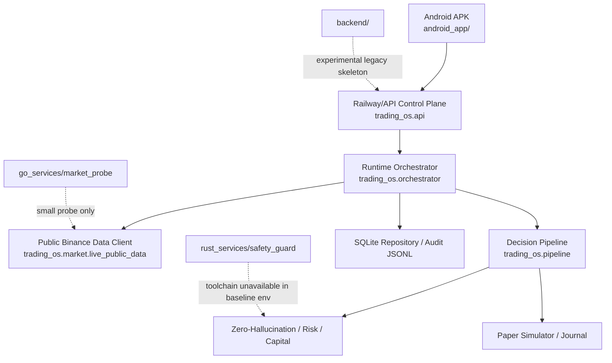

# Baseline Audit

Generated: 2026-07-15

## Repository Baseline

The repository is a mixed research, paper-trading, Android, deployment, and documentation workspace. The canonical backend is `trading_os/`. The `backend/` tree exists as an earlier experimental skeleton and should not be treated as the active runtime. Android source lives in `android_app/`. Go and Rust service roots exist under `go_services/` and `rust_services/`, but only the Go probe can currently be tested in this environment.

## Current Architecture

## Canonical Modules

- Backend/API/control plane: `trading_os/`
- Android client: `android_app/`
- Tests: `tests/`
- Railway entrypoint: `trading_os.api.app:app`
- Paper runtime: `trading_os.runtime.paper_auto_trader`, `trading_os.runtime.paper_session_scheduler`
- Decision path: `trading_os.pipeline.decision_to_trade`
- Persistence: `trading_os.db`
- Audit logging: `trading_os.audit`

## Duplicate Or Experimental Modules

- `backend/`: earlier skeleton with overlapping app/binance/market/strategy/security modules.
- Root-level `api/`, `core/`, `paper/`, `realworld/`, `dashboard/`, `modules/`: older/demo/research paths not currently canonical.
- `go_services/market_probe`: Go probe exists, but not a full market-data gateway.
- `rust_services/safety_guard`: Rust safety guard source exists, but Rust toolchain was unavailable during baseline.

## Baseline Check Results

Commands run:

- `python -B -m pytest -q`
- `python -B -m ruff check .`
- `go version; go test ./...` in `go_services/market_probe`
- `rustc --version; cargo --version; cargo test` in `rust_services/safety_guard`
- Android Kotlin compile: `.\gradlew.bat --no-daemon :app:compileDebugKotlin`

Results:

- Python tests: failed, 2 failures.
  - `tests/test_paper_session_scheduler.py::test_paper_session_scheduler_starts_scans_and_stops`
    - Cause: fake backend in the test does not provide `repository`, while paper session persistence now calls `repository.save_settings`.
  - `tests/test_strategy_catalog.py::test_strategy_catalog_items_require_evidence`
    - Cause: F&O research strategy catalog items use `RESEARCH_ONLY_LIVE_BLOCKED`, while the test expected every item to be `PAPER_ADVISORY`.
- Ruff: passed.
- Go: `go1.26.3 windows/amd64`; `go test ./...` passed for `go_services/market_probe` with no test files.
- Rust: not run; `rustc` and `cargo` were not installed/available in PATH.
- Android compile: passed.

## Post-Baseline Remediation

After recording the baseline failures, a narrow Phase 1 maintenance fix was applied:

- `PaperSessionScheduler` now tolerates embedders/tests without a repository object by skipping desired-state persistence instead of crashing.
- Strategy catalog tests now distinguish normal `PAPER_ADVISORY` strategies from explicitly live-blocked `RESEARCH_ONLY_LIVE_BLOCKED` F&O research items.

Post-fix commands run:

- `python -B -m pytest -q`: passed, 66 tests.
- `python -B -m ruff check .`: passed.
- Android Kotlin compile: passed.
- Go market probe: passed with no test files.
- `python -B -m mypy trading_os`: not run because `mypy` is not installed in the current Python environment.

## Phase 1 Increment: Market Data Quality Gate

Implemented after the baseline:

- Added `trading_os.quality.market_data_gate`.
- Added machine-readable reason codes for missing market data, stale market data, clock skew, insufficient candle/trade windows, unsynchronized order book, invalid best bid/ask, and unknown instrument.
- Integrated the gate into `PaperAutoTrader.run_once` before market data is ingested or passed to the decision pipeline.
- Invalid market data now returns `SKIP` with an auditable `reason_code`, `missing_data`, `conflicts`, and evidence payload.
- Added invariant tests in `tests/test_market_data_quality_gate.py`.

Post-increment checks:

- `python -B -m pytest -q`: passed, 71 tests.
- `python -B -m ruff check .`: passed.
- Android Kotlin compile: passed.

## Safety Gaps

- No complete strict data-quality gateway exists yet for all downstream decisions.
- Order-book processing is snapshot/public-data based; no lifecycle sequence validation gateway exists.
- `backend/` contains placeholder strategy/execution functions that can confuse architecture readers if treated as canonical.
- Several broad `except Exception` blocks exist; many are intentional safe-skip boundaries, but they should be reviewed for precise reason codes.
- Android preview data remains clearly labeled, but parser defaults can still show generic fallback values when backend fields are missing.
- Live trading remains blocked by default; no direct live Binance order placement is active in canonical `trading_os/`.

## Data-Flow Gaps

- Current paper scanning is request/session driven, not a full event-driven WebSocket market-data plane.
- Paper scan history and statement rows are audit-derived; this is acceptable for paper monitoring but not a production replay journal.
- Strategy signals were recently enriched, but decision reproducibility still needs explicit evidence hashes, market-frame hashes, and ruleset versions.
- Market-data age/staleness validation is not yet enforced as one mandatory typed gateway.

## Performance Bottlenecks

- Python handles public-data polling and scanner loops.
- No bounded market-data ring buffer or sequence-owned order-book runtime is active.
- No p50/p95/p99 latency benchmark report exists yet.
- Railway is used as a control-plane/backend deployment, not a low-latency exchange-colocated runtime.

## Packaging Status

- Android debug APK builds and installs locally.
- Windows EXE packaging is not implemented as a completed artifact.
- Dockerfile exists, but it uses root `python:3.10-slim` without a non-root runtime user.
- Railway configuration exists and points to `/status/health`.

## Railway Readiness

- Railway backend is deployed and reachable.
- Paper mode and public-data-only operation have been verified in previous runs.
- Persistent volume requirements are partially documented through env vars (`T_DATABASE_URL`, `T_AUDIT_LOG_PATH`) but need stronger deployment docs.

## Android Readiness

- Kotlin/Compose app builds.
- Phone install has been verified in prior work.
- App is a control/monitoring client only; it does not contain Binance secrets and does not directly place Binance orders.

## Windows Readiness

- No production-quality Windows `.exe` package is complete.
- No Tauri/Electron/installer workflow is complete.

## Production Blockers

- Strict typed data-quality gate is incomplete.
- Event-driven market-data plane is not implemented.
- Rust deterministic order-book core is not build-verified in this environment.
- No full paper OMS replay/reconciliation certification.
- No live-readiness certification; live trading remains intentionally blocked.
- Full CI/CD does not yet cover all requested Python/Go/Rust/Android/Desktop/security/replay checks.
