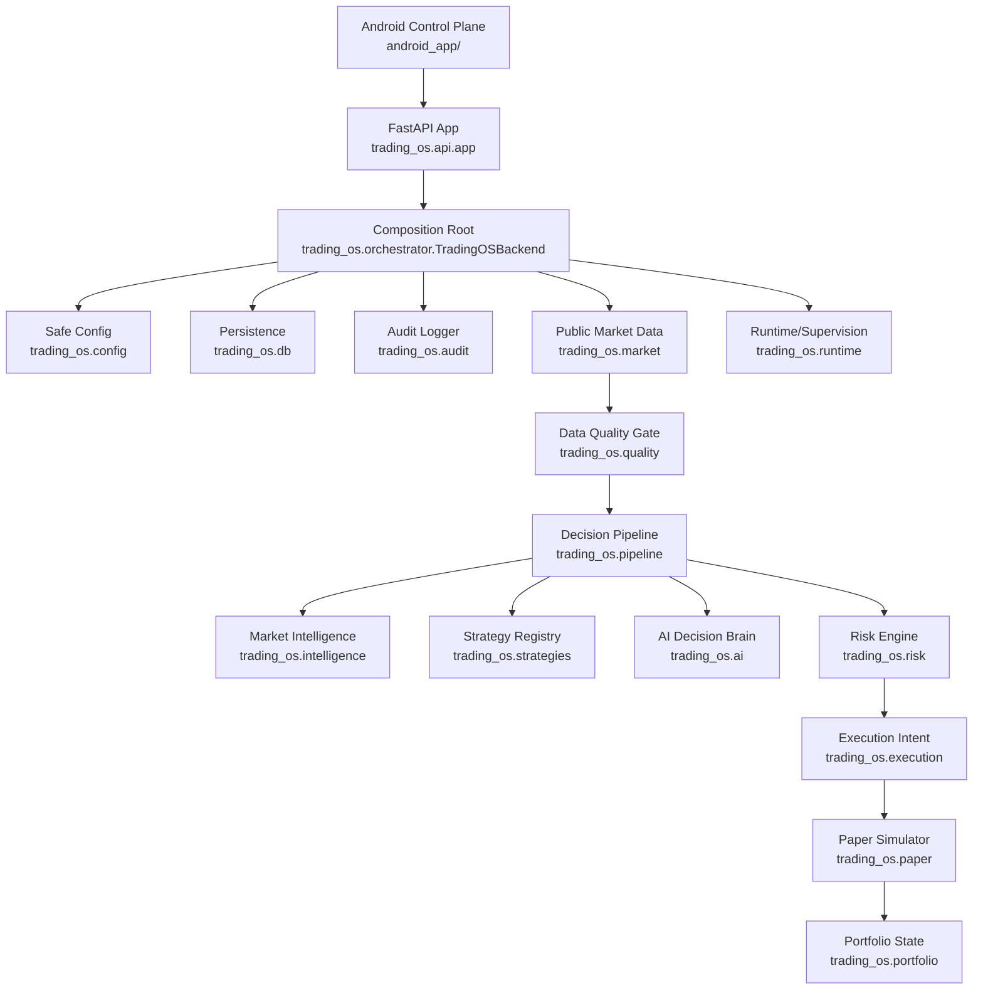

# Canonical Architecture

Status: active architecture baseline.

## Canonical Runtime

The canonical backend is `trading_os/`.

The production-style API entrypoint is:

```text
trading_os.api.app:app
```

This is verified by:

- `Dockerfile`
- `Procfile`
- `railway.json`
- `trading_os/api/app.py`
- `trading_os/orchestrator.py`

`backend/` is not a production runtime. It is an experimental scaffold retained for reference.

## Runtime Composition



Decision pipeline details are tracked in:

- [Decision Pipeline](DECISION_PIPELINE.md)
- [Decision Pipeline Stage Results](DECISION_PIPELINE_STAGES.md)

## Non-Negotiable Safety Boundaries

- Live trading remains disabled.
- Withdrawal support remains unsupported.
- Android is a monitoring/control-plane client only.
- Public market data may inform paper decisions; private Binance credentials must not be required for paper mode.
- Missing, stale, invalid, or conflicting evidence must produce `HOLD` or `SKIP`.
- Risk and kill-switch gates override strategy outputs.

## Import Boundary

Canonical code under `trading_os/` must not import from these non-canonical roots:

- `agents`
- `api`
- `backend`
- `core`
- `dashboard`
- `enterprise`
- `mobile`
- `modules`
- `nexus`
- `paper`
- `realworld`

The boundary is enforced by:

```powershell
python -B scripts/check_import_boundaries.py
```

CI runs this check before linting and tests.

## Persistence Boundary

Canonical persistence is `trading_os/db/`.

`trading_os/database/` contains older skeleton model types and is not the authoritative repository or storage layer. Compatibility should be preserved until references are removed or migrated, but new runtime persistence work must use `trading_os.db`.

## Cross-Language Boundary

Go and Rust folders are not part of the canonical runtime today.

- `go_services/market_probe`: compile-checked probe, not integrated into `trading_os`.
- `rust_services/safety_guard`: source exists, but local Rust toolchain was unavailable during Phase 0.

Any future Go/Rust runtime component must define a typed protocol, health check, timeout policy, fallback behavior, and integration tests before becoming canonical.
