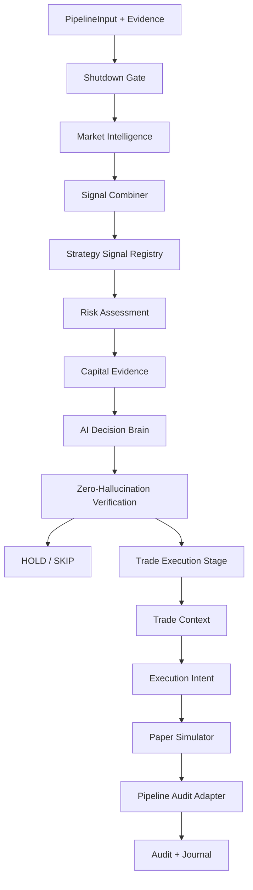

# Decision Pipeline

Status: Phase 2 hardening in progress.

The canonical decision pipeline is `trading_os.pipeline.decision_to_trade.DecisionToTradePipeline`.

The current implementation keeps the existing public API stable while adding
machine-readable stage outcomes and fail-closed behavior.

## Extracted Contracts

Phase 2 now exposes reusable stage result contracts from `trading_os.pipeline`:

- `PipelineStageName`
- `PipelineStageOutcome`
- `PipelineReasonCode`
- `PipelineStageResult`
- `PipelineStageRecorder`

`DecisionToTradePipeline` uses `PipelineStageRecorder` internally so stage
recording is no longer an ad-hoc nested helper. This is the first controlled
step toward splitting the pipeline into independent stage classes while keeping
the current API and audit payloads stable.

## Extracted Stage Classes

The first concrete stage classes are now isolated in `trading_os.pipeline.stages`:

- `ShutdownGateStage`
- `RiskAssessmentStage`
- `MarketIntelligenceStage`
- `StrategySignalStage`
- `SignalCombinationStage`
- `DecisionVerificationStage`
- `TradeExecutionStage`
- `PipelineAuditAdapter`

They use existing runtime/risk types and do not introduce a parallel execution
model. The pipeline still owns orchestration and audit payloads, but shutdown,
market-intelligence collection, signal combination, strategy-signal collection,
risk checks, AI proposal, zero-hallucination verification, trade lifecycle,
execution-intent creation, paper execution, and audit payload formatting are now
directly unit-testable.

## Current Flow



## Fail-Closed Contract

If an internal exception escapes the decision path:

- final action is `SKIP`
- status is `SKIP`
- no execution intent is created
- no paper fill is created
- stage result includes `pipeline_exception`
- reason code is `INTERNAL_EXCEPTION`

This prevents accidental trading behavior when a module fails unexpectedly.

## Regression Coverage

`tests/test_pipeline_e2e_paper_flow.py` runs a full paper-only pipeline using
mock public market data:

```text
market tick + candles + order book
-> market intelligence
-> combined signal
-> AI decision
-> zero-hallucination verification
-> risk
-> execution intent
-> paper fill
-> audit events
```

The test verifies that the final intent is not live-enabled and that audit events
for decision, execution intent, paper fill, portfolio snapshot, and final
pipeline result are written.

The same file also covers negative safety paths:

- missing core candle/order-book/market-structure data returns `SKIP`
- no execution intent is created when core data is missing
- no paper fill is created when core data is missing
- missing optional whale/news data is recorded as missing data, not converted
  into fake whale or news evidence
- missing stop-loss or take-profit is rejected by risk before intent/fill
- oversized trade quantity is rejected by risk before intent/fill

`tests/test_api_route_smoke.py` verifies key API route functions still return
safe paper-mode payloads after pipeline refactors:

- status routes report paper mode and live trading disabled
- control routes do not enable live trading
- monitor routes return public-data-only paper defaults

`tests/test_android_api_contract_static.py` statically compares Android
`BackendApiClient.kt` endpoint strings against canonical backend route
decorators. It also verifies the APK client does not expose live-trading,
withdrawal, Binance-secret, margin, or futures order endpoints.

`tests/test_android_source_structure.py` verifies the Android source scaffold,
manifest/build settings, safety UI labels, English/Hinglish support markers,
development-preview labeling, and absence of direct Binance order/secret
patterns.

`tests/test_deployment_readiness.py` verifies the Railway/Docker deployment
contract:

- Dockerfile and Procfile start `trading_os.api.app:app`
- Railway healthcheck points to `/status/health`
- default config remains paper-only
- `.env.example` uses placeholders and safe flags
- `.dockerignore` excludes secrets, APK/AAB/EXE files, build outputs, screenshots,
  client keys, deployment secrets, and private research material

## Reason-Code Contract

Stage reason codes are normalized by:

```text
trading_os.pipeline.stage_result.PipelineReasonCode
```

Unknown free-form reason text becomes `UNCLASSIFIED_REASON`; it is not treated
as `OK`.

## Still To Refactor

The pipeline is still implemented as one class. Later Phase 2 increments should
split it into independently testable stages without changing API behavior:

- data acquisition
- timestamp validation
- data quality
- feature extraction
- market intelligence - started via `MarketIntelligenceStage`
- strategy signal - started via `StrategySignalStage`
- signal consensus - started via `SignalCombinationStage`
- decision - started via `DecisionVerificationStage`
- zero-hallucination verification - started via `DecisionVerificationStage`
- risk assessment - started via `RiskAssessmentStage`
- capital allocation
- execution intent - started via `TradeExecutionStage`
- paper execution - started via `TradeExecutionStage`
- trade lifecycle - started via `TradeExecutionStage`
- audit - started via `PipelineAuditAdapter`
- notification

Any split must preserve correlation IDs, evidence lineage, stage latency, and
fail-closed behavior.
